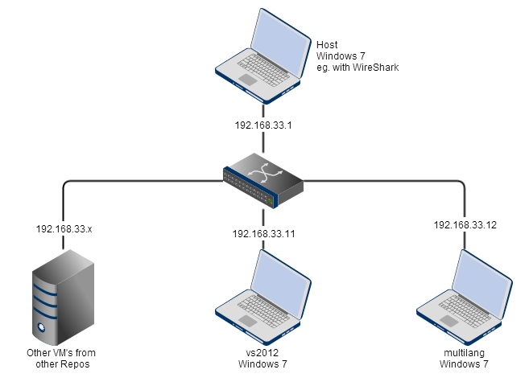
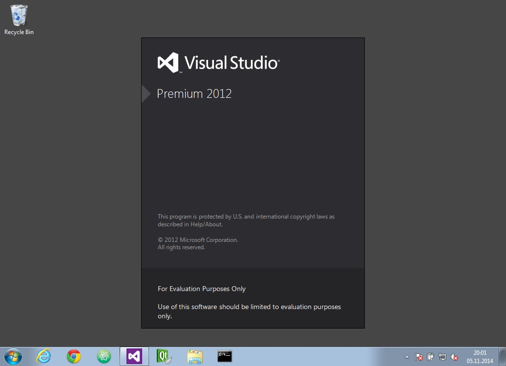
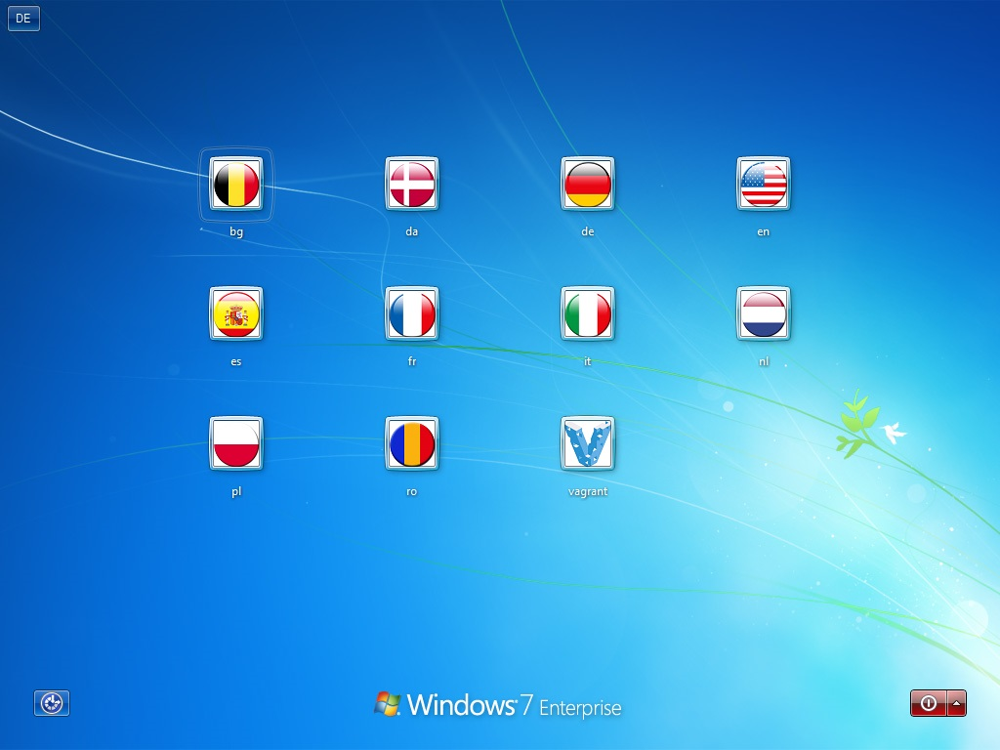

# Visual Studio 2012 development boxes

This `Vagrantfile` describes a development environment with Microsoft Visual Studio 2012 Premium for C++ development with Qt5. The following boxes are available and **best used with VirtualBox**.

The two VM's are connected through a private network 192.168.33.x.
I have other Repos that fit into this subnet so I can use them for
a bigger development and test scenario. From my host machine I can
use WireShark to debug network traffic inside the private network.



## vs2012

The development machine with at least these software installed on it:

* **Microsoft Visual Studio 2012 Premium with Update 3**
  * VisualSVN
  * **WiX Toolset** for MSI projects
  * MarkdownMode plugin
* **Qt 5.1.1 in a shared and static build** (requires files stored in `resources/` directory)
* And many other development tools:
  * Sysinternals Suite
  * pstools
  * Dependency Walker
  * Git
  * 7-Zip
  * WinMerge

The IP address of this box is 192.168.33.11.



## multilang

The test machine is provisioned with many users with **ten different Language Packs** installed.
This machine also has the **Remote Debugger** installed to work from the `vs2012` box. The default port 4061 could be used to attach to processes in this box.

The IP address of this box is 192.168.33.12.



## Setting up resources directory

To provision Qt5.1.1 into the `vs2012` box you first need your Qt developer license
and a download of the Qt enterprise sources.

```
resources/
  QtCommercial/
    Qt5.1.1/
      DistLicenseFile.txt
      qt-enterprise-5.1.1-windows-msvc2012-x86_64-offline.exe
      qt-vs-addin-1.2.2.exe
```

To skip the compile step (if you have done it once) you also can add these files

```
resources/
  QtCommercial/
    Qt5.1.1/
      msvc2012_32_static.zip
      msvc2012_64_static.zip
```

They will be extracted into `C:/Qt/Qt5.1.1/msvc2012_32_static/` and `C:/Qt/Qt5.1.1/msvc2012_64_static/`.

## Building the boxes

This boxes are tested with Vagrant 1.6.5 and VirtualBox 4.3.18, so you need at least these two tools installed on your host machine.

Then open a terminal and type

```bash
vagrant up vs2012 --provider=virtualbox
```

and in another terminal you can spin up the second box in parallel:

```bash
vagrant up multilang --provider=virtualbox
```
